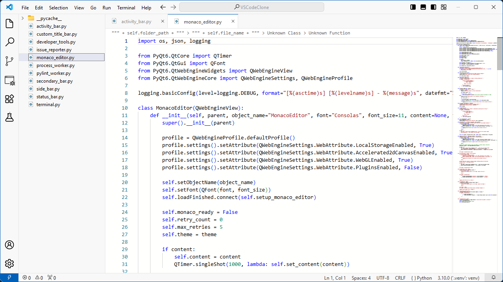
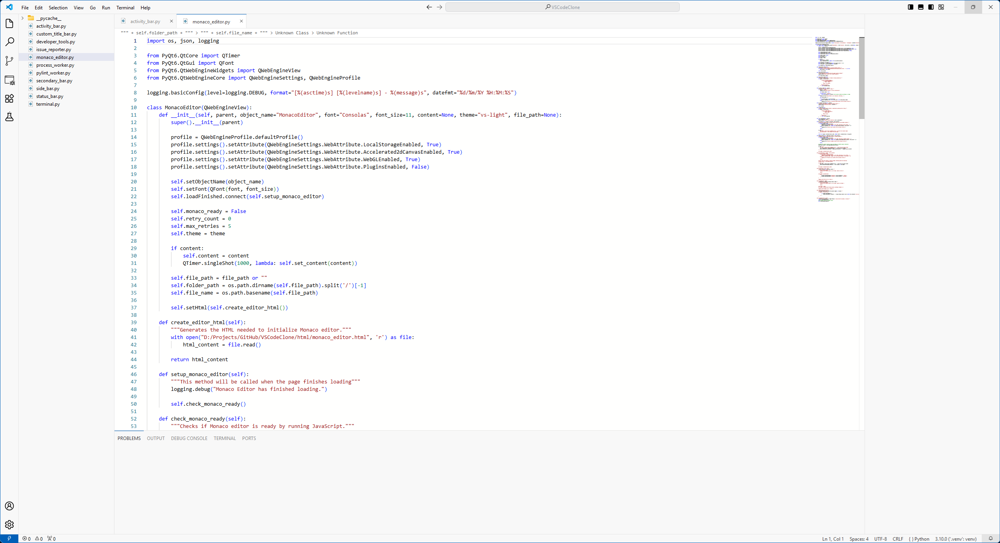

# VSCodeClone

A **Visual Studio Code-inspired code editor** built in **Python** using **PyQt6** and **Monaco Editor**.  
This project is a fully-featured code editor with multiple tabs, sidebar, panels, terminal, developer tools, and more—designed for learning, experimentation, and showcasing GUI and IDE functionality.

---

## Features

- **Multiple Tabs** with code editors (MonacoEditor integration)
- **File Management**
  - Open/save files
  - Save As and Save All functionality
  - Recent files tracking using `QSettings`
- **Folder Explorer**
  - Open and browse folders in the sidebar
  - Drag and drop files between folders
- **Panels**
  - Problems, Output, Debug Console, Terminal, Ports
  - Real-time linting with Pylint (Errors & Warnings)
- **Terminal**
  - Run Python scripts directly within the editor
  - Capture stdout/stderr
- **Resizable and Snapable Window**
  - Custom frameless window
  - Corner resizing and edge snapping
- **Activity & Secondary Bars**
  - Quick access to actions and tools
- **Developer Tools & Issue Reporter**
- **Integrated Documentation & Tutorials Links**
- **Theming**
  - Multiple `.qss` files for UI customization

---

## Screenshots

  
  

---

## Installation

### Requirements

- Python 3.11+
- [PyQt6](https://pypi.org/project/PyQt6/)
- [chardet](https://pypi.org/project/chardet/)
- [MonacoEditor PyQt wrapper](#) _(custom or integrated wrapper)_
- Optional: `pylint` for linting features

### Setup

1. **Clone the repository**

```bash
git clone https://github.com/suatalikoch/VSCodeClone.git
cd VSCodeClone
```
